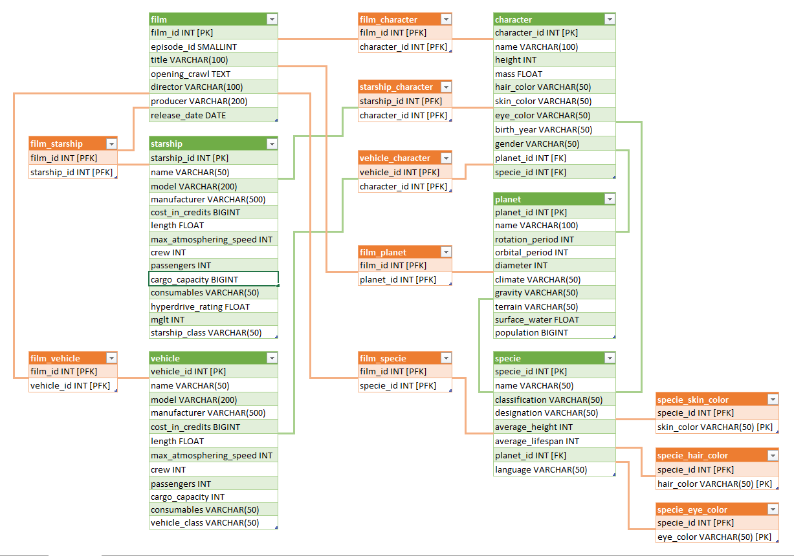

# Blu Challenge
## Descrição do Desafio
A equipe de Produtos quer lançar um novo filme de ficção científica. Para isso, eles precisam de dados dos filmes do Star Wars. Felizmente, os dados estão disponíveis nessa API https://swapi.dev/.

Seu trabalho consiste em duas etapas:

1. Construa uma API REST que receba dados genéricos e os armazene num banco relacional e num Object Storage em parquet.

2. Construa uma rotina que extraia os dados da API do Star Wars e envie para a API que você montou acima.

Utilize:
* Python.
* Banco de dados e Object Storage open source.
* Docker.

A solução deve estar em docker. Ao instanciar os containers, a migração de dados deve ocorrer populando o banco e carregando os arquivos no Storage em parquet.
Os entregáveis são os scripts Python, dockerfile, docker-compose YAML (ou outro arquivo de configuração usado para subir os serviços), e uma documentação das tabelas. 

Bônus Points: você ganha pontos extras se a solução for feita com Airflow.
## Desenvolvimento da solução
Foi escolhida a seguinte modelagem para armazenamento dos dados em Banco de Dados:

Para a construção da solução requisitada, foi necessária a criação de 7 contâiners:
### api_rest 
**Descrição:** executa o servidor responsável por receber requisições genéricas e salvar os dados provenientes em um Object Storage e em um Banco de Dados. O servidor foi criado utilizando a biblioteca flask.

**Configurações:**
* api_rest/config/models.py: onde estão mapeadas as tabelas, seus campos e suas chaves (para garantir a unicidade);
* api_rest/config/vars.py: onde estão definidas as configurações de ambiente, além das conexões com o Object Storage e o Banco de Dados.
### database
**Descrição:** foi utilizado o PostgreSQL para receber os dados provenientes de api_rest, assim como armazenar os dados de configuração do Airflow.

**Configurações:**
* database/config.env: configurações de ambiente
* database/init.sql: script SQL para execução junto à inicialização do banco
### object_storage
**Descrição:** a opção escolhida para armazenamento dos arquivos em *.parquet foi o Object Storage MinIO.

**Configurações:**
* object_storage/config.env: configurações de ambiente
### redis
**Descrição:** banco de dados utilizado para organização das filas de execução do Airflow.
### airflow_server && airflow_scheduler && airflow_worker
**Descrição:** contâiners responsáveis pela execução do Airflow.

**Configurações:**
* airflow/config.env: configurações de ambiente
## Execução da Solução
Para executar a solução, é necessária a instalação e execução das aplicações docker e docker-compose. É recomendável que a máquina utilizada tenha pelo menos 6GB de RAM para disponibilizar aos contâiners. Em seguida, acesse a pasta onde se encontrar o *docker_compose.yml* e execute no terminal: `docker-compose build` e, em seguida, `docker-compose up -d`

Aguarde entre 5-10 minutos para a correta inicialização de todos os serviços. 

Logo que os serviços inicializarem, o Airflow começará a processar a DAG disponível em airflow/dags/dag.py automaticamente. Será executada, então, a Task *star_wars_etl*, responsável por extrair todos os dados da API disponível em https://swapi.dev/ e enviá-las à nossa API de inserção de Dados. Acompanhe a execução em http://localhost:8080/ (substitua *localhost* pelo endereço do servidor caso não seja executado em ambiente local).
* Acessos:
    * Usuário: blu_champion
    * Senha: blu_challenge_accepted

Em seguida, a API processará os dados, e os salvará no bucket *datalake* do MinIO. A aplicação pode ser acessada em http://localhost:9001/.
* Acessos:
    * Usuário: blu_champion
    * Senha: blu_challenge_accepted

Para concluir, os dados serão inseridos no Banco de Dados PostgreSQL, mediante o modelo definido nas configurações da API (e tabelas criadas utilizando o script init.sql, conforme documentado mais acima). Acesse-os utilizando algum Workbench de escolha (recomendo o DBeaver).
* Acessos:
    * Host: localhost
    * Port: 5432
    * Username: blu_champion
    * Password: blu_challenge_accepted
    * Database: data_warehouse

Para finalizar a execução, utilize `docker-compose down`.

Qualquer dúvida ou dificuldade de execução, por favor entre em contato via email: 
[mauricio.borges@familiaborges.org](mailto:mauricio.borges@familiaborges.org)

